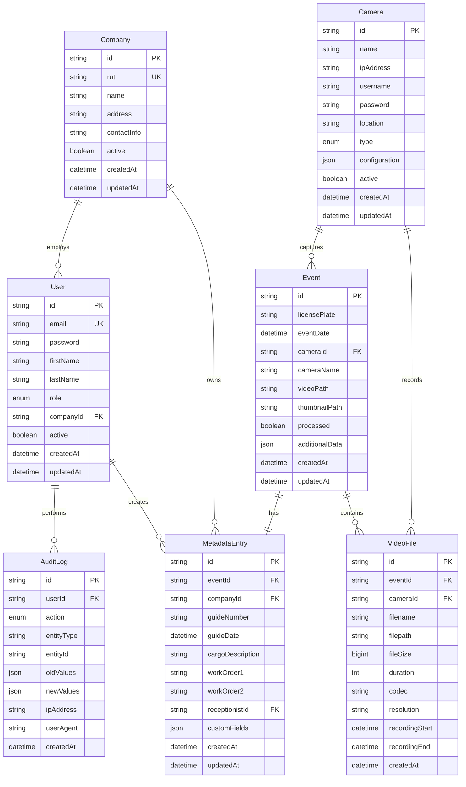

# Database Schema - DOM CCTV
## Diseño Completo de Base de Datos MySQL

### 1. Diagrama de Entidad-Relación



### 2. Definición de Tablas SQL

#### Tabla Users

```sql
CREATE TABLE users (
    id VARCHAR(30) PRIMARY KEY,
    email VARCHAR(255) UNIQUE NOT NULL,
    password VARCHAR(255) NOT NULL,
    first_name VARCHAR(100) NOT NULL,
    last_name VARCHAR(100) NOT NULL,
    role ENUM('OPERATOR', 'ADMINISTRATOR', 'CLIENT_USER', 'SUPERVISOR') NOT NULL,
    company_id VARCHAR(30),
    active BOOLEAN DEFAULT TRUE,
    last_login DATETIME,
    created_at DATETIME DEFAULT CURRENT_TIMESTAMP,
    updated_at DATETIME DEFAULT CURRENT_TIMESTAMP ON UPDATE CURRENT_TIMESTAMP,
    
    INDEX idx_settings_key (setting_key),
    INDEX idx_settings_public (is_public)
);
```

#### Tabla Sessions

```sql
CREATE TABLE sessions (
    id VARCHAR(30) PRIMARY KEY,
    user_id VARCHAR(30) NOT NULL,
    token_hash VARCHAR(255) NOT NULL,
    expires_at DATETIME NOT NULL,
    ip_address VARCHAR(45),
    user_agent TEXT,
    active BOOLEAN DEFAULT TRUE,
    created_at DATETIME DEFAULT CURRENT_TIMESTAMP,
    last_activity DATETIME DEFAULT CURRENT_TIMESTAMP,
    
    INDEX idx_sessions_user (user_id),
    INDEX idx_sessions_token (token_hash),
    INDEX idx_sessions_expires (expires_at),
    INDEX idx_sessions_active (active),
    
    FOREIGN KEY (user_id) REFERENCES users(id) ON DELETE CASCADE
);
```

### 3. Datos de Ejemplo

#### Datos Base del Sistema

```sql
-- Insertar configuraciones básicas del sistema
INSERT INTO system_settings (id, setting_key, setting_value, setting_type, description, is_public) VALUES
('cfg_001', 'app_name', '"DOM CCTV"', 'STRING', 'Nombre de la aplicación', TRUE),
('cfg_002', 'video_retention_days', '120', 'NUMBER', 'Días de retención de videos', FALSE),
('cfg_003', 'thumbnail_generation', 'true', 'BOOLEAN', 'Generar thumbnails automáticamente', FALSE),
('cfg_004', 'sync_interval_minutes', '60', 'NUMBER', 'Intervalo de sincronización con Hikvision', FALSE),
('cfg_005', 'max_file_size_mb', '100', 'NUMBER', 'Tamaño máximo de archivo en MB', FALSE);

-- Insertar cámaras del sistema
INSERT INTO cameras (id, name, ip_address, username, password, location, type, configuration, active) VALUES
('cam_001', 'Entrada Principal ANPR', '192.168.1.101', 'admin', 'password123', 'Portón de Entrada', 'ANPR', '{"resolution": "2560x1920", "fps": 15, "night_vision": true}', TRUE),
('cam_002', 'Salida Principal ANPR', '192.168.1.102', 'admin', 'password123', 'Portón de Salida', 'ANPR', '{"resolution": "2560x1920", "fps": 15, "night_vision": true}', TRUE),
('cam_003', 'Zona Descarga 1', '192.168.1.103', 'admin', 'password123', 'Bahía de Descarga 1', 'DOCUMENTARY', '{"resolution": "3072x2048", "fps": 15, "zoom": "3x"}', TRUE),
('cam_004', 'Zona Descarga 2', '192.168.1.104', 'admin', 'password123', 'Bahía de Descarga 2', 'DOCUMENTARY', '{"resolution": "3072x2048", "fps": 15, "zoom": "3x"}', TRUE),
('cam_005', 'Zona Conteo 1', '192.168.1.105', 'admin', 'password123', 'Área de Conteo 1', 'DOCUMENTARY', '{"resolution": "3072x2048", "fps": 15, "auto_focus": true}', TRUE),
('cam_006', 'Zona Conteo 2', '192.168.1.106', 'admin', 'password123', 'Área de Conteo 2', 'DOCUMENTARY', '{"resolution": "3072x2048", "fps": 15, "auto_focus": true}', TRUE),
('cam_007', 'Panorámica Patio', '192.168.1.107', 'admin', 'password123', 'Vista General Patio', 'PTZ', '{"resolution": "3072x2048", "fps": 15, "pan_tilt": true, "zoom": "30x"}', TRUE),
('cam_008', 'Báscula', '192.168.1.108', 'admin', 'password123', 'Zona de Pesaje', 'DOCUMENTARY', '{"resolution": "3072x2048", "fps": 15, "wide_angle": true}', TRUE),
('cam_009', 'Almacén Entrada', '192.168.1.109', 'admin', 'password123', 'Entrada Almacén', 'DOCUMENTARY', '{"resolution": "3072x2048", "fps": 15}', TRUE),
('cam_010', 'Almacén Salida', '192.168.1.110', 'admin', 'password123', 'Salida Almacén', 'DOCUMENTARY', '{"resolution": "3072x2048", "fps": 15}', TRUE);

-- Insertar empresa de ejemplo
INSERT INTO companies (id, rut, name, address, contact_info, active) VALUES
('comp_001', '76.123.456-7', 'Transportes Ejemplo S.A.', 'Av. Industrial 1234, Santiago', 
'{"phone": "+56912345678", "email": "contacto@transportes.cl", "contact_person": "Juan Pérez"}', TRUE),
('comp_002', '96.789.012-3', 'Logística del Sur Ltda.', 'Ruta 5 Sur Km 45, Rancagua',
'{"phone": "+56987654321", "email": "info@logisticasur.cl", "contact_person": "María González"}', TRUE);

-- Insertar usuarios de ejemplo
INSERT INTO users (id, email, password, first_name, last_name, role, company_id, active) VALUES
('user_001', 'admin@domcctv.cl', '$2b$10$rQZ4vJZYvHGHdVHJdVHJdVHJdVHJdVHJ', 'Administrador', 'Sistema', 'ADMINISTRATOR', NULL, TRUE),
('user_002', 'operador@domcctv.cl', '$2b$10$rQZ4vJZYvHGHdVHJdVHJdVHJdVHJdVHJ', 'Carlos', 'Operador', 'OPERATOR', NULL, TRUE),
('user_003', 'supervisor@domcctv.cl', '$2b$10$rQZ4vJZYvHGHdVHJdVHJdVHJdVHJdVHJ', 'Ana', 'Supervisora', 'SUPERVISOR', NULL, TRUE),
('user_004', 'cliente1@transportes.cl', '$2b$10$rQZ4vJZYvHGHdVHJdVHJdVHJdVHJdVHJ', 'Juan', 'Pérez', 'CLIENT_USER', 'comp_001', TRUE),
('user_005', 'recepcion@transportes.cl', '$2b$10$rQZ4vJZYvHGHdVHJdVHJdVHJdVHJdVHJ', 'Rosa', 'Recepcionista', 'CLIENT_USER', 'comp_001', TRUE);
```

### 4. Índices de Rendimiento

#### Índices Compuestos Críticos

```sql
-- Búsquedas frecuentes por matrícula y fecha
CREATE INDEX idx_events_search ON events(license_plate, event_date DESC, processed);

-- Búsquedas por compañía y fecha para usuarios cliente
CREATE INDEX idx_metadata_company_date ON metadata_entries(company_id, guide_date DESC);

-- Auditoría por usuario y fecha
CREATE INDEX idx_audit_user_date ON audit_logs(user_id, created_at DESC);

-- Videos por evento y cámara
CREATE INDEX idx_video_event_camera ON video_files(event_id, camera_id);

-- Sesiones activas
CREATE INDEX idx_sessions_active_user ON sessions(active, user_id, expires_at);

-- Eventos sin procesar
CREATE INDEX idx_events_unprocessed ON events(processed, created_at) WHERE processed = FALSE;
```

### 5. Vistas SQL para Consultas Comunes

#### Vista de Eventos Completos

```sql
CREATE VIEW v_events_complete AS
SELECT 
    e.id,
    e.license_plate,
    e.event_date,
    e.camera_id,
    e.camera_name,
    e.video_path,
    e.thumbnail_path,
    e.processed,
    e.confidence_level,
    e.created_at,
    
    -- Metadatos
    m.id as metadata_id,
    m.guide_number,
    m.guide_date,
    m.cargo_description,
    m.work_order_1,
    m.work_order_2,
    
    -- Empresa
    c.id as company_id,
    c.rut as company_rut,
    c.name as company_name,
    
    -- Recepcionista
    u.id as receptionist_id,
    u.first_name as receptionist_first_name,
    u.last_name as receptionist_last_name,
    
    -- Archivos de video
    vf.id as video_file_id,
    vf.filename as video_filename,
    vf.file_size as video_file_size,
    vf.duration as video_duration
    
FROM events e
LEFT JOIN metadata_entries m ON e.id = m.event_id
LEFT JOIN companies c ON m.company_id = c.id
LEFT JOIN users u ON m.receptionist_id = u.id
LEFT JOIN video_files vf ON e.id = vf.event_id;
```

#### Vista de Dashboard de Actividad

```sql
CREATE VIEW v_dashboard_stats AS
SELECT 
    DATE(e.event_date) as date,
    COUNT(*) as total_events,
    COUNT(m.id) as events_with_metadata,
    COUNT(DISTINCT e.license_plate) as unique_vehicles,
    COUNT(DISTINCT m.company_id) as active_companies,
    AVG(e.confidence_level) as avg_confidence
FROM events e
LEFT JOIN metadata_entries m ON e.id = m.event_id
WHERE e.event_date >= DATE_SUB(CURDATE(), INTERVAL 30 DAY)
GROUP BY DATE(e.event_date)
ORDER BY date DESC;
```

### 6. Triggers de Auditoría

#### Trigger para Auditar Cambios en Metadatos

```sql
DELIMITER //

CREATE TRIGGER audit_metadata_changes
AFTER UPDATE ON metadata_entries
FOR EACH ROW
BEGIN
    INSERT INTO audit_logs (
        id,
        user_id,
        action,
        entity_type,
        entity_id,
        old_values,
        new_values,
        created_at
    ) VALUES (
        CONCAT('audit_', UUID_SHORT()),
        @current_user_id,
        'UPDATE',
        'metadata_entry',
        NEW.id,
        JSON_OBJECT(
            'guide_number', OLD.guide_number,
            'guide_date', OLD.guide_date,
            'cargo_description', OLD.cargo_description,
            'work_order_1', OLD.work_order_1,
            'work_order_2', OLD.work_order_2
        ),
        JSON_OBJECT(
            'guide_number', NEW.guide_number,
            'guide_date', NEW.guide_date,
            'cargo_description', NEW.cargo_description,
            'work_order_1', NEW.work_order_1,
            'work_order_2', NEW.work_order_2
        ),
        NOW()
    );
END//

DELIMITER ;
```

### 7. Procedimientos Almacenados

#### Búsqueda Avanzada de Eventos

```sql
DELIMITER //

CREATE PROCEDURE SearchEvents(
    IN p_license_plate VARCHAR(20),
    IN p_start_date DATETIME,
    IN p_end_date DATETIME,
    IN p_company_id VARCHAR(30),
    IN p_camera_id VARCHAR(30),
    IN p_limit INT,
    IN p_offset INT
)
BEGIN
    SET @sql = 'SELECT * FROM v_events_complete WHERE 1=1';
    
    IF p_license_plate IS NOT NULL THEN
        SET @sql = CONCAT(@sql, ' AND license_plate LIKE ''%', p_license_plate, '%''');
    END IF;
    
    IF p_start_date IS NOT NULL THEN
        SET @sql = CONCAT(@sql, ' AND event_date >= ''', p_start_date, '''');
    END IF;
    
    IF p_end_date IS NOT NULL THEN
        SET @sql = CONCAT(@sql, ' AND event_date <= ''', p_end_date, '''');
    END IF;
    
    IF p_company_id IS NOT NULL THEN
        SET @sql = CONCAT(@sql, ' AND company_id = ''', p_company_id, '''');
    END IF;
    
    IF p_camera_id IS NOT NULL THEN
        SET @sql = CONCAT(@sql, ' AND camera_id = ''', p_camera_id, '''');
    END IF;
    
    SET @sql = CONCAT(@sql, ' ORDER BY event_date DESC');
    
    IF p_limit IS NOT NULL THEN
        SET @sql = CONCAT(@sql, ' LIMIT ', p_limit);
    END IF;
    
    IF p_offset IS NOT NULL THEN
        SET @sql = CONCAT(@sql, ' OFFSET ', p_offset);
    END IF;
    
    PREPARE stmt FROM @sql;
    EXECUTE stmt;
    DEALLOCATE PREPARE stmt;
END//

DELIMITER ;
```

### 8. Configuración de Particionamiento

#### Particionamiento de AuditLogs por Fecha

```sql
-- Crear tabla particionada para audit_logs
CREATE TABLE audit_logs_partitioned (
    id VARCHAR(30) PRIMARY KEY,
    user_id VARCHAR(30) NOT NULL,
    action ENUM('CREATE', 'READ', 'UPDATE', 'DELETE', 'LOGIN', 'LOGOUT', 'SEARCH', 'EXPORT') NOT NULL,
    entity_type VARCHAR(50) NOT NULL,
    entity_id VARCHAR(30),
    old_values JSON,
    new_values JSON,
    ip_address VARCHAR(45),
    user_agent TEXT,
    success BOOLEAN DEFAULT TRUE,
    error_message TEXT,
    created_at DATETIME DEFAULT CURRENT_TIMESTAMP,
    
    INDEX idx_audit_user (user_id),
    INDEX idx_audit_action (action),
    INDEX idx_audit_entity (entity_type, entity_id),
    INDEX idx_audit_date (created_at),
    
    FOREIGN KEY (user_id) REFERENCES users(id) ON DELETE RESTRICT
)
PARTITION BY RANGE (YEAR(created_at)) (
    PARTITION p2024 VALUES LESS THAN (2025),
    PARTITION p2025 VALUES LESS THAN (2026),
    PARTITION p2026 VALUES LESS THAN (2027),
    PARTITION p_future VALUES LESS THAN MAXVALUE
);
```

### 9. Configuración de Backup y Mantenimiento

#### Script de Backup Automático

```sql
-- Evento para backup diario
CREATE EVENT daily_backup
ON SCHEDULE EVERY 1 DAY
STARTS CURRENT_TIMESTAMP
DO
BEGIN
    -- Backup de tablas críticas
    SET @backup_date = DATE_FORMAT(NOW(), '%Y%m%d');
    
    -- Limpiar logs antiguos (más de 1 año)
    DELETE FROM audit_logs WHERE created_at < DATE_SUB(NOW(), INTERVAL 1 YEAR);
    
    -- Limpiar sesiones expiradas
    DELETE FROM sessions WHERE expires_at < NOW();
    
    -- Optimizar tablas
    OPTIMIZE TABLE events, metadata_entries, video_files;
END;
```

### 10. Configuración de Replicación

#### Master-Slave para Alta Disponibilidad

```sql
-- Configuración en el servidor master
-- /etc/mysql/mysql.conf.d/mysqld.cnf

[mysqld]
server-id = 1
log-bin = mysql-bin
binlog-format = ROW
expire_logs_days = 7
max_binlog_size = 100M

# Bases de datos a replicar
binlog-do-db = dom_cctv

# Configuración InnoDB para rendimiento
innodb_buffer_pool_size = 2G
innodb_log_file_size = 256M
innodb_flush_log_at_trx_commit = 2
innodb_file_per_table = 1

# Configuración de conexiones
max_connections = 200
thread_cache_size = 50
query_cache_size = 64M
query_cache_limit = 2M
```

### 11. Métricas y Monitoreo

#### Views para Monitoring

```sql
-- Vista de métricas de rendimiento
CREATE VIEW v_performance_metrics AS
SELECT 
    'total_events' as metric,
    COUNT(*) as value,
    'count' as unit
FROM events
UNION ALL
SELECT 
    'events_today' as metric,
    COUNT(*) as value,
    'count' as unit
FROM events 
WHERE DATE(created_at) = CURDATE()
UNION ALL
SELECT 
    'avg_events_per_day' as metric,
    ROUND(COUNT(*) / DATEDIFF(MAX(created_at), MIN(created_at)), 2) as value,
    'count/day' as unit
FROM events
UNION ALL
SELECT 
    'total_storage_mb' as metric,
    ROUND(SUM(file_size) / 1024 / 1024, 2) as value,
    'MB' as unit
FROM video_files;
```

---

**Esquema de base de datos completo optimizado para el sistema DOM CCTV con funcionalidades avanzadas de CCTV y gestión empresarial**TIMESTAMP ON UPDATE CURRENT_TIMESTAMP,
    
    INDEX idx_users_email (email),
    INDEX idx_users_role (role),
    INDEX idx_users_company (company_id),
    
    FOREIGN KEY (company_id) REFERENCES companies(id) ON DELETE SET NULL
);
```

#### Tabla Companies

```sql
CREATE TABLE companies (
    id VARCHAR(30) PRIMARY KEY,
    rut VARCHAR(20) UNIQUE NOT NULL,
    name VARCHAR(255) NOT NULL,
    address TEXT,
    contact_info JSON,
    active BOOLEAN DEFAULT TRUE,
    created_at DATETIME DEFAULT CURRENT_TIMESTAMP,
    updated_at DATETIME DEFAULT CURRENT_TIMESTAMP ON UPDATE CURRENT_TIMESTAMP,
    
    INDEX idx_companies_rut (rut),
    INDEX idx_companies_name (name),
    INDEX idx_companies_active (active)
);
```

#### Tabla Cameras

```sql
CREATE TABLE cameras (
    id VARCHAR(30) PRIMARY KEY,
    name VARCHAR(100) NOT NULL,
    ip_address VARCHAR(45) NOT NULL,
    username VARCHAR(100),
    password VARCHAR(255),
    location VARCHAR(255),
    type ENUM('ANPR', 'DOCUMENTARY', 'THERMAL', 'PTZ') NOT NULL,
    configuration JSON,
    active BOOLEAN DEFAULT TRUE,
    created_at DATETIME DEFAULT CURRENT_TIMESTAMP,
    updated_at DATETIME DEFAULT CURRENT_TIMESTAMP ON UPDATE CURRENT_TIMESTAMP,
    
    INDEX idx_cameras_type (type),
    INDEX idx_cameras_active (active),
    INDEX idx_cameras_location (location),
    UNIQUE KEY unique_camera_ip (ip_address)
);
```

#### Tabla Events

```sql
CREATE TABLE events (
    id VARCHAR(30) PRIMARY KEY,
    license_plate VARCHAR(20) NOT NULL,
    event_date DATETIME NOT NULL,
    camera_id VARCHAR(30) NOT NULL,
    camera_name VARCHAR(100) NOT NULL,
    video_path VARCHAR(500),
    thumbnail_path VARCHAR(500),
    processed BOOLEAN DEFAULT FALSE,
    confidence_level DECIMAL(5,2),
    additional_data JSON,
    created_at DATETIME DEFAULT CURRENT_TIMESTAMP,
    updated_at DATETIME DEFAULT CURRENT_TIMESTAMP ON UPDATE CURRENT_TIMESTAMP,
    
    INDEX idx_events_license_plate (license_plate),
    INDEX idx_events_date (event_date),
    INDEX idx_events_camera (camera_id),
    INDEX idx_events_processed (processed),
    INDEX idx_events_license_date (license_plate, event_date),
    
    FOREIGN KEY (camera_id) REFERENCES cameras(id) ON DELETE RESTRICT
);
```

#### Tabla MetadataEntries

```sql
CREATE TABLE metadata_entries (
    id VARCHAR(30) PRIMARY KEY,
    event_id VARCHAR(30) UNIQUE NOT NULL,
    company_id VARCHAR(30) NOT NULL,
    guide_number VARCHAR(100) NOT NULL,
    guide_date DATE NOT NULL,
    cargo_description TEXT NOT NULL,
    work_order_1 VARCHAR(100) NOT NULL,
    work_order_2 VARCHAR(100),
    receptionist_id VARCHAR(30) NOT NULL,
    custom_fields JSON,
    created_at DATETIME DEFAULT CURRENT_TIMESTAMP,
    updated_at DATETIME DEFAULT CURRENT_TIMESTAMP ON UPDATE CURRENT_TIMESTAMP,
    
    INDEX idx_metadata_event (event_id),
    INDEX idx_metadata_company (company_id),
    INDEX idx_metadata_guide_number (guide_number),
    INDEX idx_metadata_guide_date (guide_date),
    INDEX idx_metadata_work_order (work_order_1),
    INDEX idx_metadata_receptionist (receptionist_id),
    
    FOREIGN KEY (event_id) REFERENCES events(id) ON DELETE CASCADE,
    FOREIGN KEY (company_id) REFERENCES companies(id) ON DELETE RESTRICT,
    FOREIGN KEY (receptionist_id) REFERENCES users(id) ON DELETE RESTRICT
);
```

#### Tabla VideoFiles

```sql
CREATE TABLE video_files (
    id VARCHAR(30) PRIMARY KEY,
    event_id VARCHAR(30) NOT NULL,
    camera_id VARCHAR(30) NOT NULL,
    filename VARCHAR(255) NOT NULL,
    filepath VARCHAR(500) NOT NULL,
    file_size BIGINT NOT NULL,
    duration INT, -- seconds
    codec VARCHAR(50),
    resolution VARCHAR(20),
    frame_rate DECIMAL(5,2),
    recording_start DATETIME NOT NULL,
    recording_end DATETIME NOT NULL,
    checksum VARCHAR(64),
    archived BOOLEAN DEFAULT FALSE,
    archive_date DATETIME,
    created_at DATETIME DEFAULT CURRENT_TIMESTAMP,
    
    INDEX idx_video_event (event_id),
    INDEX idx_video_camera (camera_id),
    INDEX idx_video_recording_start (recording_start),
    INDEX idx_video_archived (archived),
    INDEX idx_video_filename (filename),
    
    FOREIGN KEY (event_id) REFERENCES events(id) ON DELETE CASCADE,
    FOREIGN KEY (camera_id) REFERENCES cameras(id) ON DELETE RESTRICT
);
```

#### Tabla AuditLogs

```sql
CREATE TABLE audit_logs (
    id VARCHAR(30) PRIMARY KEY,
    user_id VARCHAR(30) NOT NULL,
    action ENUM('CREATE', 'READ', 'UPDATE', 'DELETE', 'LOGIN', 'LOGOUT', 'SEARCH', 'EXPORT') NOT NULL,
    entity_type VARCHAR(50) NOT NULL,
    entity_id VARCHAR(30),
    old_values JSON,
    new_values JSON,
    ip_address VARCHAR(45),
    user_agent TEXT,
    success BOOLEAN DEFAULT TRUE,
    error_message TEXT,
    created_at DATETIME DEFAULT CURRENT_TIMESTAMP,
    
    INDEX idx_audit_user (user_id),
    INDEX idx_audit_action (action),
    INDEX idx_audit_entity (entity_type, entity_id),
    INDEX idx_audit_date (created_at),
    INDEX idx_audit_ip (ip_address),
    
    FOREIGN KEY (user_id) REFERENCES users(id) ON DELETE RESTRICT
);
```

#### Tabla SystemSettings

```sql
CREATE TABLE system_settings (
    id VARCHAR(30) PRIMARY KEY,
    setting_key VARCHAR(100) UNIQUE NOT NULL,
    setting_value JSON NOT NULL,
    setting_type ENUM('STRING', 'NUMBER', 'BOOLEAN', 'JSON', 'ARRAY') NOT NULL,
    description TEXT,
    is_public BOOLEAN DEFAULT FALSE,
    requires_restart BOOLEAN DEFAULT FALSE,
    created_at DATETIME DEFAULT CURRENT_TIMESTAMP,
    updated_at DATETIME DEFAULT CURRENT_